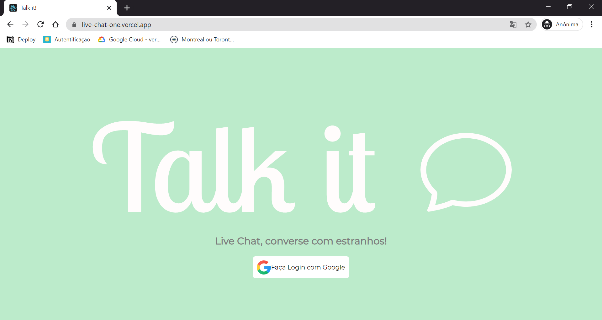

<h1 align="center"></h1>

<p align="center">
 <a href="#project">Projeto</a> •
 <a href="#clone">Clone</a> • 
 <a href="#license">Licença</a>
</p>

<h2 id="project" >Talk It!</h2>

O Projeto consiste em um Live Chat de canal único construído em React utilizando serviços Firebase, o qual os usuários podem logar com sua conta do Google e conversar com todos online!

<p align="center">
  
</p>

<h3 align="center"><a href="https://live-chat-one.vercel.app/">💻 Visite clicando aqui</a></h3>

<h2 id="clone" >Clone</h2>

Para rodar o Talk It localmente em modo desenvolvimento você deve:

```
git clone https://github.com/Fernanda-Kipper/LiveChat.git
npm install
npm run-script dev
OPEN http://localhost:3000
```

No local de npm você pode utilizar o package manager de sua preferência

### Atenção ‼

Não é recomendado armazenar suas chaves de acesso a API no lado do cliente, nesse projeto fora utilizado as variáveis de ambiente react app estritamente para estudo e prática, mas em modo de produção esssa prática não é recomendada 

<h2 id="license">Licença</h2>

Esse projeto está sob a licença [MIT](LICENSE)

